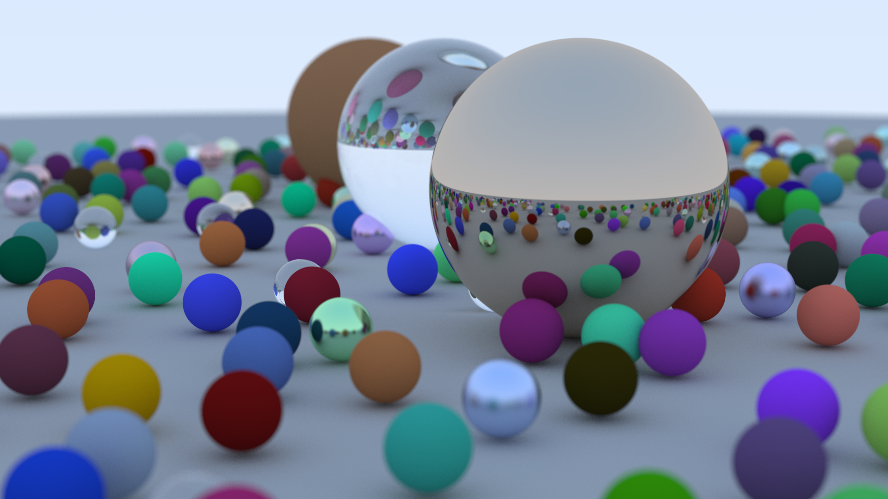

# YAUS-RT
Yet Another Ultra Simple Ray Tracer (Based on [_Ray Tracing in One Weekend_](https://raytracing.github.io/books/RayTracingInOneWeekend.html) book).



## Motivation behind this project
I started this project to study my mid year math/technical exam (4th year) at [Pole 3D](https://pole3d.com/).

## Getting Started

These instructions will get you a copy of the project up and running on your local machine for development and testing purposes.

### Prerequisites

What things you need to install the software and how to install them

```
Install CMake, make and a C++ compiler (Only tested on Ubuntu 20.04).
```

### Installing

In the repository directory:

```
$ cmake -S ./ -B ./build
```

Then go to the "/build" directory:

```
$ make
```

To start a render:

```
$ ./YAUSRT > image.ppm
```

End with an PPM image (similar to the image in the top).

## Built With

* [C++]()

## Versioning

* V 0.1.0: Code after reading [_Ray Tracing in One Weekend_](https://raytracing.github.io/books/RayTracingInOneWeekend.html) with minor tweaks

## Possible Improvements
**This are not really planned for now, it's only conjectures.**

* Starting the next book of the serie: [_Ray Tracing: The Next Week_](https://raytracing.github.io/books/RayTracingTheNextWeek.html)
* Add arguments to define image size.
* Add libpng for direct export to PNG file format instead of PPM.
* Add lights.
* Add Triangles to the renderer.
* Support custom scene file (That store geometry, light and camera informations).
* Add Alembic (.abc) file support.
* Build a DCC link (to show render in a 3D software).
## Authors

* **Léo DEPOIX** - *Initial work* - [PiloeGAO](https://github.com/piloegao)


## License

This project is licensed under the GPL-V3 License - see the [LICENSE.md](LICENSE.md) file for details

## Acknowledgments

* [Guillaume Baratte](https://github.com/BaratteG/) for his course about "Vex and Maths" at [Pole 3D](https://pole3d.com/).
* This project was successfully done thanks to [Peter Shirley](https://twitter.com/Peter_shirley) book: [_Ray Tracing in One Weekend_](https://raytracing.github.io/books/RayTracingInOneWeekend.html).